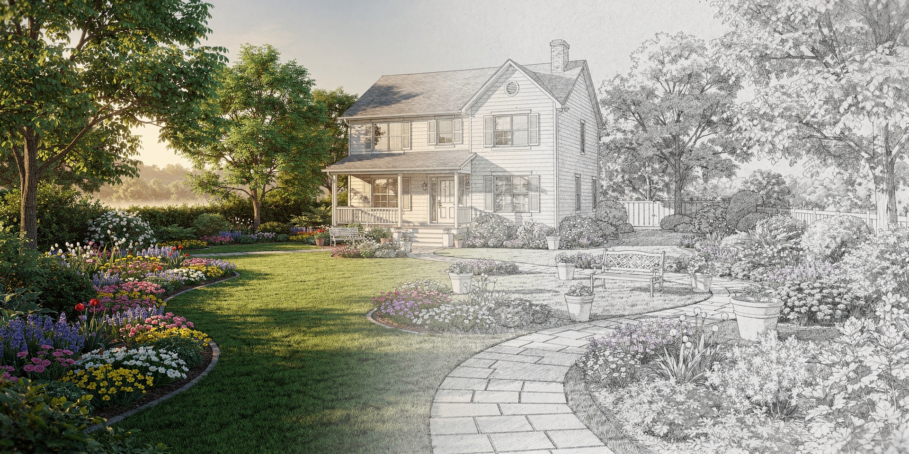

# Open Garden Planner

**Precision garden planning for passionate gardeners who value independence and transparency.**

Open Garden Planner is an open-source desktop application that combines CAD-like metric accuracy with garden-specific features. Plan your garden with centimeter precision, track plants with rich metadata, and export to standard formats - all without subscription fees or vendor lock-in.

## Why Open Garden Planner?

Existing tools are either:
- **Expensive commercial software** with subscription fees and proprietary formats
- **Visual-only planners** that lack metric precision
- **General CAD tools** that require steep learning curves and lack garden features

Open Garden Planner fills the gap: **engineering-grade precision meets gardener-friendly workflows**.

## Features

- **Metric Accuracy**: Plan with centimeter-level precision on a calibrated canvas
- **Image Calibration**: Import satellite imagery and calibrate to real-world scale
- **Rich Plant Metadata**: Track species, varieties, planting dates, and growing requirements
- **Online Plant Database**: Search Trefle.io, Perenual, and Permapeople for plant data
- **Object Library**: Property structures, garden beds, plants, paths, fences
- **Layers**: Organize objects into manageable layers with visibility/lock controls
- **Standard Formats**: JSON project files (.ogp), PNG/SVG export, CSV plant lists
- **Modern UI**: Clean interface with light and dark modes, keyboard shortcuts
- **Auto-Save**: Periodic auto-save with crash recovery

## Installation

### Windows Installer (recommended)

Download the latest installer from the [Releases](https://github.com/cofade/open-garden-planner/releases/latest) page:

> **[Download OpenGardenPlanner-v1.0.0-Setup.exe](https://github.com/cofade/open-garden-planner/releases/latest)**

Run the installer and follow the wizard. It will:
- Install to `C:\Program Files\Open Garden Planner` (configurable)
- Create Start Menu and optional desktop shortcuts
- Optionally associate `.ogp` files so you can double-click to open them
- Register in Add/Remove Programs for clean uninstallation

**System requirements:** Windows 10+ (64-bit), 4 GB RAM, 200 MB disk space.

#### Verify your download

Each release includes a `SHA256SUMS.txt` file. To verify the installer integrity:

```powershell
# PowerShell
(Get-FileHash .\OpenGardenPlanner-v1.0.0-Setup.exe -Algorithm SHA256).Hash
```

Compare the output with the hash in `SHA256SUMS.txt` from the release page.

### Install from source

Requires Python 3.11+ and Git.

```bash
git clone https://github.com/cofade/open-garden-planner.git
cd open-garden-planner
python -m venv venv
venv\Scripts\activate     # Windows
# source venv/bin/activate  # Linux/Mac
pip install -e .
python -m open_garden_planner
```

### Build the installer yourself

If you prefer to build the installer from source:

```bash
git clone https://github.com/cofade/open-garden-planner.git
cd open-garden-planner
python -m venv venv
venv\Scripts\activate
pip install -e .
pip install pyinstaller

# Build PyInstaller bundle + NSIS installer (requires NSIS: https://nsis.sourceforge.io/)
python installer/build_installer.py
```

The installer will be created at `dist\OpenGardenPlanner-v1.0.0-Setup.exe`.

### Plant Database (optional)

To enable online plant search, see the [Plant API Setup Guide](docs/03-context-and-scope/PLANT_API_SETUP.md).

## Tech Stack

- **Python 3.11+** with **PyQt6** for desktop UI
- **QGraphicsView** for hardware-accelerated 2D canvas
- **Trefle.io / Perenual / Permapeople** APIs for plant species data
- **pytest + pytest-qt** for testing

## Status

**Phases 1-5 complete.** Currently working on Phase 6: Visual Polish & Public Release (v1.0).

See the [Development Roadmap](docs/roadmap.md) for detailed progress.

## Documentation

Project documentation follows the [arc42](https://arc42.org/) architecture template:

| Document | Description |
|----------|-------------|
| [Introduction & Goals](docs/01-introduction-and-goals/) | Product vision, target users |
| [Functional Requirements](docs/functional-requirements.md) | Detailed requirements specification |
| [Solution Strategy](docs/04-solution-strategy/) | Technology choices and design decisions |
| [Building Block View](docs/05-building-block-view/) | Architecture and module structure |
| [Development Roadmap](docs/roadmap.md) | Phases, user stories, progress tracking |
| [All Documentation](docs/01-introduction-and-goals/prd.md) | Documentation index |

## Contributing

We welcome contributions! This project aims to be technically clean and attractive for both users and contributors.

- Read the [Roadmap](docs/roadmap.md) and [Architecture](docs/05-building-block-view/) to understand the vision
- Check the Issues for tasks and discussions
- PRs must pass CI (tests, linting, type checking)

**AI-assisted development is welcome.** Feel free to use Claude Code, GitHub Copilot, Cursor, or other AI-powered coding tools. We care about the quality of the result, not how you got there. Just ensure every contribution includes proper tests - unit tests, integration tests, and UI tests where applicable.

## License

[GPLv3](LICENSE) - Free software, free forever.

---

*Built with passion for gardeners who demand precision.*
