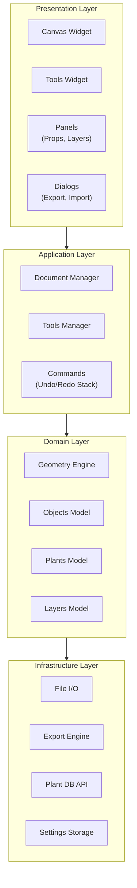

# 5. Building Block View

## 5.1 High-Level Architecture



## 5.2 Module Structure

<!-- Keep this updated when adding/removing files -->

```
src/open_garden_planner/
├── __main__.py, main.py          # Entry points
├── app/
│   ├── application.py            # Main window (GardenPlannerApp)
│   └── settings.py               # App-level settings/preferences
├── core/
│   ├── commands.py               # Undo/redo command pattern
│   ├── project.py                # Save/load, ProjectManager
│   ├── object_types.py           # ObjectType enum, default styles
│   ├── fill_patterns.py          # Texture/pattern rendering
│   ├── plant_renderer.py         # Plant SVG loading, caching, rendering
│   ├── furniture_renderer.py     # Furniture/hedge SVG rendering & caching
│   ├── constraints.py            # All 16 constraint types + hybrid solver (see §8.12)
│   ├── constraint_solver_newton.py # Newton-Raphson refinement + circle-circle fast path
│   ├── measure_snapper.py        # Anchor-point snapper for measure tool
│   ├── measurements.py           # Measurement data model
│   ├── snapping.py               # Object snapping logic
│   ├── alignment.py              # Object alignment helpers
│   ├── i18n.py                   # Internationalization, translator loading
│   ├── geometry/                 # Point, Polygon, Rectangle primitives
│   └── tools/                    # Drawing tools
│       ├── base_tool.py          # ToolType enum, BaseTool ABC
│       ├── tool_manager.py       # ToolManager with signals
│       ├── select_tool.py        # Selection + box select + vertex editing
│       ├── rectangle_tool.py     # Rectangle drawing
│       ├── polygon_tool.py       # Polygon drawing
│       ├── circle_tool.py        # Circle drawing
│       ├── polyline_tool.py      # Polyline/path drawing
│       ├── measure_tool.py       # Distance measurement
│       └── constraint_tool.py    # Distance constraint creation
├── models/
│   ├── plant_data.py             # Plant data model
│   ├── layer.py                  # Layer model
│   ├── soil_test.py              # SoilTestRecord & SoilTestHistory (US-12.10a)
│   └── amendment.py              # Amendment & AmendmentRecommendation (US-12.10c)
├── ui/
│   ├── canvas/
│   │   ├── canvas_view.py        # Pan/zoom, key/mouse handling
│   │   ├── canvas_scene.py       # Scene (holds objects)
│   │   ├── dimension_lines.py    # Dimension line rendering & management
│   │   └── items/                # Canvas item types
│   │       ├── garden_item.py    # GardenItem base class
│   │       ├── rectangle_item.py
│   │       ├── polygon_item.py
│   │       ├── circle_item.py
│   │       ├── polyline_item.py
│   │       ├── background_image_item.py
│   │       └── resize_handle.py
│   ├── panels/
│   │   ├── drawing_tools_panel.py
│   │   ├── properties_panel.py
│   │   ├── layers_panel.py
│   │   ├── gallery_panel.py      # Thumbnail gallery sidebar
│   │   ├── plant_database_panel.py
│   │   └── plant_search_panel.py
│   ├── dialogs/
│   │   ├── new_project_dialog.py
│   │   ├── welcome_dialog.py
│   │   ├── calibration_dialog.py
│   │   ├── custom_plants_dialog.py
│   │   ├── export_dialog.py
│   │   ├── preferences_dialog.py
│   │   ├── print_dialog.py
│   │   ├── shortcuts_dialog.py
│   │   ├── plant_search_dialog.py
│   │   └── properties_dialog.py
│   ├── widgets/
│   │   ├── toolbar.py            # MainToolbar
│   │   └── collapsible_panel.py
│   └── theme.py                  # Light/Dark theme system
├── services/
│   ├── plant_api/                # Trefle.io/Perenual/Permapeople integration
│   │   ├── base.py
│   │   ├── manager.py
│   │   ├── perenual_client.py
│   │   ├── permapeople_client.py
│   │   └── trefle_client.py
│   ├── plant_library.py          # Local plant library management
│   ├── bundled_species_db.py     # Bundled species DB loader + drop-flow hook (issue #170)
│   ├── export_service.py         # PDF/image export
│   ├── autosave_service.py       # Autosave logic
│   ├── soil_service.py           # Soil test history facade (US-12.10a)
│   └── update_checker.py         # GitHub releases update check (frozen exe only)
└── resources/
    ├── icons/                    # App icons, banner, tool SVGs
    ├── textures/                 # Tileable PNG textures
    ├── plants/                   # Plant SVG illustrations
    ├── translations/             # .ts source & .qm compiled translations
    ├── data/
    │   ├── plant_species.json    # Bundled species DB (118 records, issue #170)
    │   ├── amendments.json       # Soil amendment substances (US-12.10c)
    │   ├── companion_planting.json
    │   └── seed_viability.json
    └── objects/                  # Object SVG illustrations
        ├── furniture/            # Outdoor furniture SVGs
        └── infrastructure/       # Garden infrastructure SVGs

installer/                        # Windows installer build files
├── ogp.spec                      # PyInstaller spec (--onedir bundle)
├── ogp_installer.nsi             # NSIS installer script (wizard, registry)
├── build_installer.py            # Build orchestration script
├── ogp_app.ico                   # Application icon (multi-size)
└── ogp_file.ico                  # .ogp file type icon

tests/
├── unit/                         # Unit tests
├── integration/                  # Integration tests
└── ui/                           # UI tests (pytest-qt)
```

## 5.3 Object Model

All drawable entities inherit from a common base:

```python
class GardenObject(ABC):
    id: UUID
    name: str
    layer_id: UUID
    geometry: Geometry        # Abstract geometry
    style: ObjectStyle        # Fill, stroke, opacity
    metadata: dict[str, Any]  # Extensible properties
    rotation: float           # Degrees
    z_elevation: float = 0.0  # For future 3D
    height: float = 0.0       # For future 3D extrusion
```

### Object Type Hierarchy


Concrete shape types: `RectangleObject` (house, garage, terrace, driveway), `PolygonObject` (custom shapes, garden beds), `CircleObject` (ponds, circular features), `PolylineObject` (fences, paths, walls). `FurnitureObject` (Phase 6) covers tables, chairs, benches, parasols, BBQs etc.; `InfrastructureObject` (Phase 6) covers raised beds, compost bins, greenhouses etc.

## 5.4 Project File Format

```json
{
  "version": "1.0",
  "metadata": {
    "name": "My Garden",
    "created": "2025-01-15T10:30:00Z",
    "modified": "2025-01-20T14:22:00Z",
    "units": "cm",
    "location": {"lat": 52.52, "lon": 13.405}
  },
  "canvas": {
    "width": 5000,
    "height": 3000,
    "background_color": "#f5f5dc"
  },
  "layers": [...],
  "objects": [...],
  "background_images": [...],
  "plant_library": {...}
}
```
