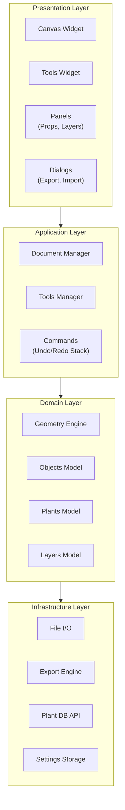
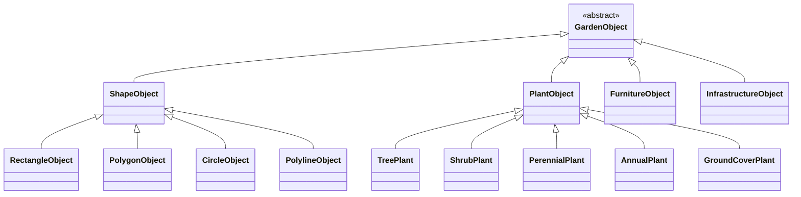

# 5. Building Block View

## 5.1 High-Level Architecture



## 5.2 Module Structure

<!-- Keep this updated when adding/removing files -->

```
src/open_garden_planner/
├── __main__.py, main.py          # Entry points
├── app/
│   ├── application.py            # Main window (GardenPlannerApp)
│   └── settings.py               # App-level settings/preferences
├── core/
│   ├── commands.py               # Undo/redo command pattern
│   ├── project.py                # Save/load, ProjectManager
│   ├── object_types.py           # ObjectType enum, default styles
│   ├── fill_patterns.py          # Texture/pattern rendering
│   ├── plant_renderer.py         # Plant SVG loading, caching, rendering
│   ├── plant_sizing.py           # PlantSizing resolver — footprint/override/max_spread precedence (ADR-028)
│   ├── furniture_renderer.py     # Furniture/hedge SVG rendering & caching
│   ├── constraints.py            # All 16 constraint types + hybrid solver (see §8.12)
│   ├── constraint_solver_newton.py # Newton-Raphson refinement + circle-circle fast path
│   ├── measure_snapper.py        # Anchor-point snapper for measure tool
│   ├── measurements.py           # Measurement data model
│   ├── snapping.py               # Object snapping logic (drag-time bbox)
│   ├── snap/                     # Unified snap engine (ADR-020 + ADR-023, Package A/B)
│   │   ├── provider.py           #   SnapProvider ABC (+reference_point in v2), SnapCandidate
│   │   ├── registry.py           #   Active-providers + best() tie-breaking
│   │   ├── point_snapper.py      #   QuadTree-backed point-snap entry point
│   │   ├── spatial_index.py      #   Bounded-depth QuadTree (~60ms / 1000 items)
│   │   ├── geometry.py           #   item_edges, segment_intersection
│   │   └── providers/            #   Endpoint, Center, EdgeCardinal, Midpoint,
│   │                             #     Intersection, Nearest, Perpendicular, Tangent
│   ├── cad_geometry.py           # arc_from_three_points, fillet_corner, chamfer_corner,
│   │                             #   reflect_point/reflect_angle_deg/snap_point_to_axis_step (US-B4)
│   ├── mirror_geometry.py        # build_mirrored_item — per-type reflection rebuild (US-B4, ADR-026)
│   ├── coordinate_input/         # Typed coordinate pipeline (ADR-021, Package A US-A1/A2/A4)
│   │   ├── parser.py             #   parse(@dx,dy / @dist<angle / x,y), smart decimal
│   │   └── buffer.py             #   CoordinateInputBuffer(QObject) — shared state
│   ├── alignment.py              # Object alignment helpers
│   ├── i18n.py                   # Internationalization, translator loading
│   ├── geometry/                 # Point, Polygon, Rectangle primitives
│   └── tools/                    # Drawing tools
│       ├── base_tool.py          # ToolType enum, BaseTool ABC
│       ├── tool_manager.py       # ToolManager with signals
│       ├── select_tool.py        # Selection + box select + vertex editing
│       ├── rectangle_tool.py     # Rectangle drawing
│       ├── polygon_tool.py       # Polygon drawing
│       ├── circle_tool.py        # Circle drawing
│       ├── polyline_tool.py      # Polyline/path drawing
│       ├── arc_tool.py           # 3-point arc drawing (Package B US-B2)
│       ├── bezier_tool.py        # Cubic Bezier pen tool (Package B US-B1)
│       ├── corner_edit_base.py   # Shared corner-picking for Fillet / Chamfer
│       ├── fillet_tool.py        # Round-corner tool (Package B US-B3)
│       ├── chamfer_tool.py       # Bevel-corner tool (Package B US-B3)
│       ├── mirror_tool.py        # Mirror selection across an axis (Package B US-B4)
│       ├── trim_tool.py          # Trim/Extend (US-11.16)
│       ├── offset_tool.py        # Parallel-copy offset (US-11.15)
│       ├── measure_tool.py       # Distance measurement
│       └── constraint_tool.py    # Distance constraint creation
├── models/
│   ├── plant_data.py             # Plant data model
│   ├── layer.py                  # Layer model
│   ├── soil_test.py              # SoilTestRecord & SoilTestHistory (US-12.10a)
│   ├── pest_log.py               # PestLogRecord & PestLogHistory (US-12.7)
│   ├── harvest_log.py            # HarvestRecord & HarvestHistory (US-C1)
│   ├── journal_note.py           # JournalNote — map-linked notes (US-12.9)
│   ├── amendment.py              # Amendment & AmendmentRecommendation (US-12.10c)
│   └── task.py                   # ManualTask — user-created reminder (US-C2, ADR-029)
├── ui/
│   ├── canvas/
│   │   ├── canvas_view.py        # Pan/zoom, key/mouse handling
│   │   ├── canvas_scene.py       # Scene (holds objects)
│   │   ├── dimension_lines.py    # Dimension line rendering & management
│   │   └── items/                # Canvas item types
│   │       ├── garden_item.py    # GardenItem base class
│   │       ├── rectangle_item.py
│   │       ├── polygon_item.py
│   │       ├── circle_item.py
│   │       ├── polyline_item.py
│   │       ├── arc_item.py       # ArcItem (Package B US-B2)
│   │       ├── bezier_item.py    # BezierItem (Package B US-B1)
│   │       ├── background_image_item.py
│   │       └── resize_handle.py
│   ├── panels/
│   │   ├── drawing_tools_panel.py
│   │   ├── properties_panel.py
│   │   ├── layers_panel.py
│   │   ├── plant_database_panel.py
│   │   ├── plant_search_panel.py
│   │   ├── pest_overview_panel.py # Active pest/disease overview (US-12.7)
│   │   └── journal_panel.py      # Garden-journal browser w/ search + date range (US-12.9)
│   ├── dialogs/
│   │   ├── new_project_dialog.py
│   │   ├── welcome_dialog.py
│   │   ├── calibration_dialog.py
│   │   ├── custom_plants_dialog.py
│   │   ├── export_dialog.py
│   │   ├── preferences_dialog.py
│   │   ├── print_dialog.py
│   │   ├── shortcuts_dialog.py
│   │   ├── plant_search_dialog.py
│   │   ├── shopping_list_dialog.py # Garden→Shopping List dialog (US-12.6)
│   │   ├── pest_log_dialog.py    # Pest/disease log entry (US-12.7)
│   │   ├── journal_note_dialog.py # Garden-journal note editor (US-12.9)
│   │   ├── map_picker_dialog.py  # Embedded Google Maps satellite picker (ADR-019)
│   │   ├── task_dialog.py        # Create/edit a ManualTask (US-C2, ADR-029)
│   │   └── properties_dialog.py
│   ├── views/
│   │   └── tasks_view.py         # Unified Tasks dashboard tab + build_plan_state (US-C2, ADR-029)
│   ├── widgets/
│   │   ├── toolbar.py            # MainToolbar (5 CAD-style core tools)
│   │   ├── constraint_toolbar.py # ConstraintToolbar (CAD constraints)
│   │   ├── category_toolbar.py   # CategoryToolbar (10 category dropdowns + global search) (ADR-018)
│   │   ├── category_dropdown.py  # Popup palette under each category button (ADR-018)
│   │   ├── global_search.py      # Toolbar object search across all categories (ADR-018)
│   │   ├── gallery_data.py       # Source of truth for placeable objects (ADR-018)
│   │   ├── coordinate_input_field.py # Status-bar typed coordinate input (ADR-021)
│   │   ├── dynamic_input_overlay.py  # Cursor-anchored Dynamic Input overlay (ADR-021)
│   │   └── collapsible_panel.py
│   └── theme.py                  # Light/Dark theme system
├── services/
│   ├── plant_api/                # Trefle.io/Perenual/Permapeople integration
│   │   ├── base.py
│   │   ├── manager.py
│   │   ├── perenual_client.py
│   │   ├── permapeople_client.py
│   │   └── trefle_client.py
│   ├── plant_library.py          # Local plant library management
│   ├── bundled_species_db.py     # Bundled species DB loader + drop-flow hook (issue #170)
│   ├── scene_rendering.py        # Shared region-render helper (ADR-023, used by PNG + viewport)
│   ├── export_service.py         # PDF/image export
│   ├── autosave_service.py       # Autosave logic
│   ├── soil_service.py           # Soil test history facade (US-12.10a)
│   ├── task_generator.py         # Pure (PlanState)->list[Task] generators + generate_all (US-C2, ADR-029)
│   ├── harvest_aggregation.py    # Pure per-species/year/unit harvest totals (US-C1)
│   ├── task_status.py            # Render-time effective_status (open/snoozed/done/dismissed/archived) (US-C2)
│   ├── shopping_list_service.py  # Plants/seed-gap/material aggregator (US-12.6)
│   ├── google_maps_service.py    # Static Maps HTTP + tile-mosaic stitching (ADR-019)
│   └── update_checker.py         # GitHub releases update check (frozen exe only)
└── resources/
    ├── icons/                    # App icons, banner, tool SVGs
    ├── textures/                 # Tileable PNG textures
    ├── plants/                   # Plant SVG illustrations
    ├── translations/             # .ts source & .qm compiled translations
    ├── data/
    │   ├── plant_species.json    # Bundled species DB (118 records, issue #170)
    │   ├── amendments.json       # Soil amendment substances (US-12.10c)
    │   ├── companion_planting.json
    │   └── seed_viability.json
    ├── objects/                  # Object SVG illustrations
    │   ├── furniture/            # Outdoor furniture SVGs
    │   └── infrastructure/       # Garden infrastructure SVGs
    └── web/                      # HTML loaded by QWebEngineView (ADR-019)
        └── map_picker.html       # Google Maps picker UI for satellite import

installer/                        # Windows installer build files
├── ogp.spec                      # PyInstaller spec (--onedir bundle)
├── ogp_installer.nsi             # NSIS installer script (wizard, registry)
├── build_installer.py            # Build orchestration script
├── ogp_app.ico                   # Application icon (multi-size)
└── ogp_file.ico                  # .ogp file type icon

tests/
├── unit/                         # Unit tests
├── integration/                  # Integration tests
└── ui/                           # UI tests (pytest-qt)
```

## 5.3 Object Model

All drawable entities inherit from a common base:

```python
class GardenObject(ABC):
    id: UUID
    name: str
    layer_id: UUID
    geometry: Geometry        # Abstract geometry
    style: ObjectStyle        # Fill, stroke, opacity
    metadata: dict[str, Any]  # Extensible properties
    rotation: float           # Degrees
    z_elevation: float = 0.0  # For future 3D
    height: float = 0.0       # For future 3D extrusion
```

### Object Type Hierarchy



Concrete shape types: `RectangleObject` (house, garage, terrace, driveway), `PolygonObject` (custom shapes, garden beds), `CircleObject` (ponds, circular features), `PolylineObject` (fences, paths, walls). `FurnitureObject` (Phase 6) covers tables, chairs, benches, parasols, BBQs etc.; `InfrastructureObject` (Phase 6) covers raised beds, compost bins, greenhouses etc.

## 5.4 Project File Format

```json
{
  "version": "1.0",
  "metadata": {
    "name": "My Garden",
    "created": "2025-01-15T10:30:00Z",
    "modified": "2025-01-20T14:22:00Z",
    "units": "cm",
    "location": {"lat": 52.52, "lon": 13.405}
  },
  "canvas": {
    "width": 5000,
    "height": 3000,
    "background_color": "#f5f5dc"
  },
  "layers": [...],
  "objects": [...],
  "background_images": [...],
  "plant_library": {...}
}
```

## 5.5 Task Subsystem (US-C2)

Black-box view of the unified Tasks tab. See ADR-029 and FR-21.

| Building block | Responsibility | Interface (in → out) |
|----------------|----------------|----------------------|
| `services/task_generator.py` | Derive the actionable to-do list from a project snapshot. Owns the frozen `Task` value object, the `PlanState` snapshot, six pure `(PlanState) -> list[Task]` generators (planting-calendar windows, propagation, succession sow/clear, soil amendments, frost protection, manual tasks) and `generate_all` (flat-map + dedup by `task_id`). Qt-free. | `PlanState` in → `list[Task]` out |
| `services/task_status.py` | Resolve a stored raw task state against "today" into a render-time status. No scheduler — expired snoozes read `open`, done > 7 days reads `archived`. | raw state + today → `effective_status` ∈ {open, snoozed, done, dismissed, archived} |
| `models/task.py` (`ManualTask`) | Data model for a user-created reminder (date, title, notes, optional bed link). Serialized under the additive `.ogp` key `manual_tasks`; Add/Edit/Delete are undoable. | dict ⇄ `ManualTask` |
| `services/harvest_aggregation.py` | Roll the project's `harvest_logs` into per-species, per-year, per-unit totals for the Harvest dashboard tab, CSV export and PDF summary page. Groups by `(species, year, unit)` — different units never summed. Qt-free. | `harvest_logs` dict → `list[AggregatedHarvest]` |
| `models/harvest_log.py` (`HarvestRecord`/`HarvestHistory`) | Per-target (plant/bed) yield records (date, quantity, unit, quality, notes, photo, linked journal-note id). Serialized under the additive `.ogp` key `harvest_logs` keyed by item UUID; history caches `species_key`/`species_name`. Add/Edit/Delete undoable, auto-maintaining a pin-less `harvest`-tagged journal note. | dict ⇄ `HarvestHistory` |
| `ui/views/tasks_view.py` (`TasksView`) | Dashboard tab (Ctrl+5, appended after Seed Inventory). Builds the Qt-side `PlanState` (`build_plan_state`), runs the generators, applies `effective_status`, groups Overdue/Today/This Week/Upcoming/No date plus Snoozed/Done sections, and writes done/snooze/dismiss through `set_task_status` (which keeps the legacy `task_completions` store in sync). Reuses the planting calendar's single weather fetch via `frost_alerts_ready`. | project state + signals in → grouped task UI |
