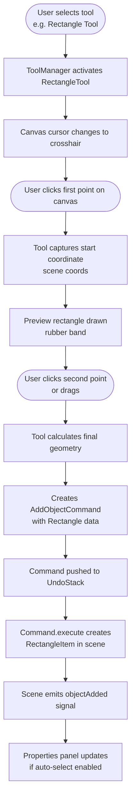
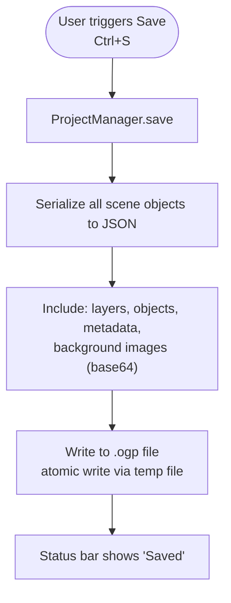
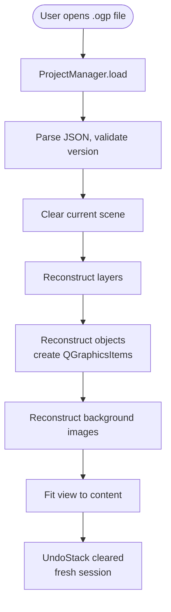
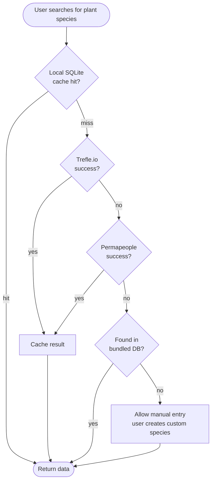
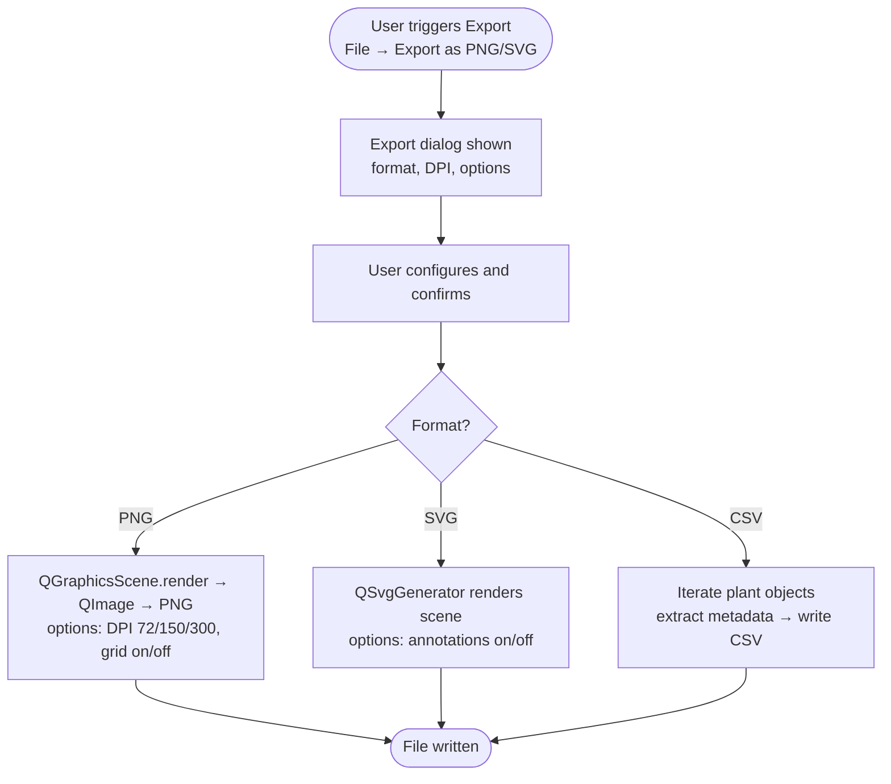
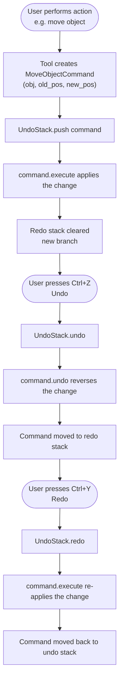
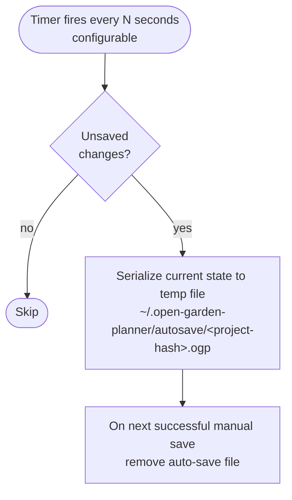
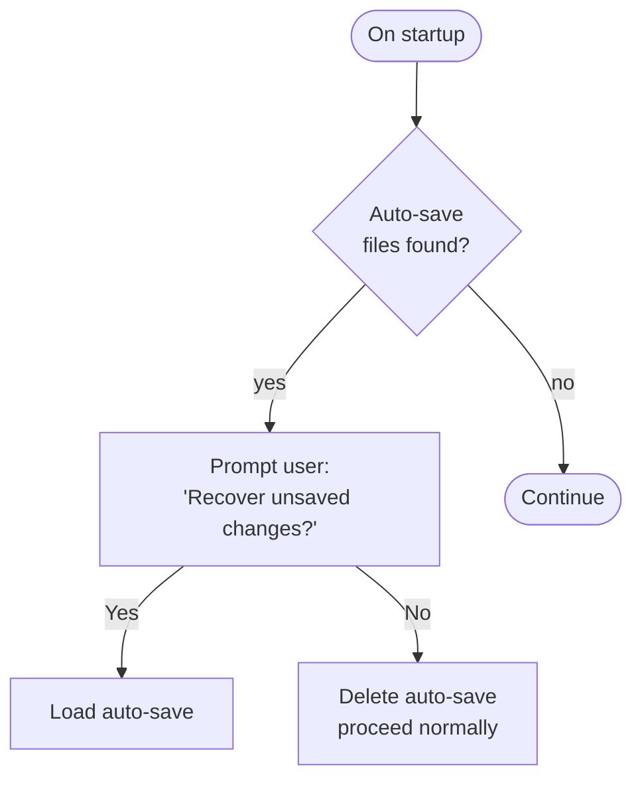

# 6. Runtime View

## 6.1 Drawing Workflow

```mermaid
flowchart TD
    A([User selects tool<br/>e.g. Rectangle Tool])
    A1[ToolManager activates RectangleTool]
    A2[Canvas cursor changes to crosshair]
    B([User clicks first point on canvas])
    B1[Tool captures start coordinate<br/>scene coords]
    B2[Preview rectangle drawn<br/>rubber band]
    C([User clicks second point<br/>or drags])
    C1[Tool calculates final geometry]
    C2[Creates AddObjectCommand<br/>with Rectangle data]
    C3[Command pushed to UndoStack]
    C4[Command.execute creates<br/>RectangleItem in scene]
    C5[Scene emits objectAdded signal]
    C6[Properties panel updates<br/>if auto-select enabled]

    A --> A1 --> A2 --> B
    B --> B1 --> B2 --> C
    C --> C1 --> C2 --> C3 --> C4 --> C5 --> C6
```

## 6.2 Save/Load Flow

### Save

```mermaid
flowchart TD
    S0([User triggers Save<br/>Ctrl+S])
    S1[ProjectManager.save]
    S2[Serialize all scene objects to JSON]
    S3["Include: layers, objects, metadata,<br/>background images (base64)"]
    S4[Write to .ogp file<br/>atomic write via temp file]
    S5[Status bar shows 'Saved']

    S0 --> S1 --> S2 --> S3 --> S4 --> S5
```

### Load

```mermaid
flowchart TD
    L0([User opens .ogp file])
    L1[ProjectManager.load]
    L2[Parse JSON, validate version]
    L3[Clear current scene]
    L4[Reconstruct layers]
    L5[Reconstruct objects<br/>create QGraphicsItems]
    L6[Reconstruct background images]
    L7[Fit view to content]
    L8[UndoStack cleared<br/>fresh session]

    L0 --> L1 --> L2 --> L3 --> L4 --> L5 --> L6 --> L7 --> L8
```

## 6.3 Plant API Integration Flow

```mermaid
flowchart TD
    Start([User searches for plant species])
    Cache{Local SQLite<br/>cache hit?}
    Trefle{Trefle.io<br/>success?}
    Perma{Permapeople<br/>success?}
    Bundled{Found in<br/>bundled DB?}
    Manual[Allow manual entry<br/>user creates custom species]
    Return([Return data])
    CacheWrite[Cache result]

    Start --> Cache
    Cache -->|hit| Return
    Cache -->|miss| Trefle
    Trefle -->|yes| CacheWrite
    Trefle -->|no| Perma
    Perma -->|yes| CacheWrite
    Perma -->|no| Bundled
    Bundled -->|yes| Return
    Bundled -->|no| Manual
    Manual --> Return
    CacheWrite --> Return
```

## 6.4 Export Flow

```mermaid
flowchart TD
    Start(["User triggers Export<br/>File → Export as PNG/SVG"])
    Dlg[Export dialog shown<br/>format, DPI, options]
    Conf[User configures and confirms]
    Fmt{Format?}

    PNG["QGraphicsScene.render → QImage → PNG<br/>options: DPI 72/150/300, grid on/off"]
    SVG["QSvgGenerator renders scene<br/>options: annotations on/off"]
    CSV[Iterate plant objects<br/>extract metadata → write CSV]

    Done([File written])

    Start --> Dlg --> Conf --> Fmt
    Fmt -->|PNG| PNG --> Done
    Fmt -->|SVG| SVG --> Done
    Fmt -->|CSV| CSV --> Done
```

## 6.5 Undo/Redo Flow

```mermaid
flowchart TD
    A([User performs action<br/>e.g. move object])
    A1["Tool creates MoveObjectCommand<br/>(obj, old_pos, new_pos)"]
    A2[UndoStack.push command]
    A3[command.execute applies the change]
    A4[Redo stack cleared<br/>new branch]

    B([User presses Ctrl+Z<br/>Undo])
    B1[UndoStack.undo]
    B2[command.undo reverses the change]
    B3[Command moved to redo stack]

    C([User presses Ctrl+Y<br/>Redo])
    C1[UndoStack.redo]
    C2[command.execute re-applies the change]
    C3[Command moved back to undo stack]

    A --> A1 --> A2 --> A3 --> A4
    A4 --> B
    B --> B1 --> B2 --> B3
    B3 --> C
    C --> C1 --> C2 --> C3
```

## 6.6 Auto-Save Flow

```mermaid
flowchart TD
    T([Timer fires every N seconds<br/>configurable])
    Dirty{Unsaved<br/>changes?}
    Skip([Skip])
    Ser["Serialize current state to temp file<br/>~/.open-garden-planner/autosave/&lt;project-hash&gt;.ogp"]
    Manual[On next successful manual save<br/>remove auto-save file]

    T --> Dirty
    Dirty -->|no| Skip
    Dirty -->|yes| Ser --> Manual
```

```mermaid
flowchart TD
    Boot([On startup])
    Check{Auto-save<br/>files found?}
    Prompt["Prompt user:<br/>'Recover unsaved changes?'"]
    Load[Load auto-save]
    Del[Delete auto-save<br/>proceed normally]
    Done([Continue])

    Boot --> Check
    Check -->|no| Done
    Check -->|yes| Prompt
    Prompt -->|Yes| Load
    Prompt -->|No| Del
```
