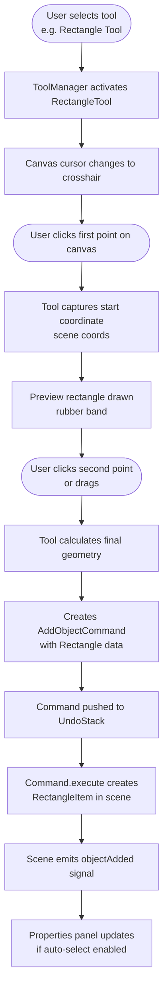
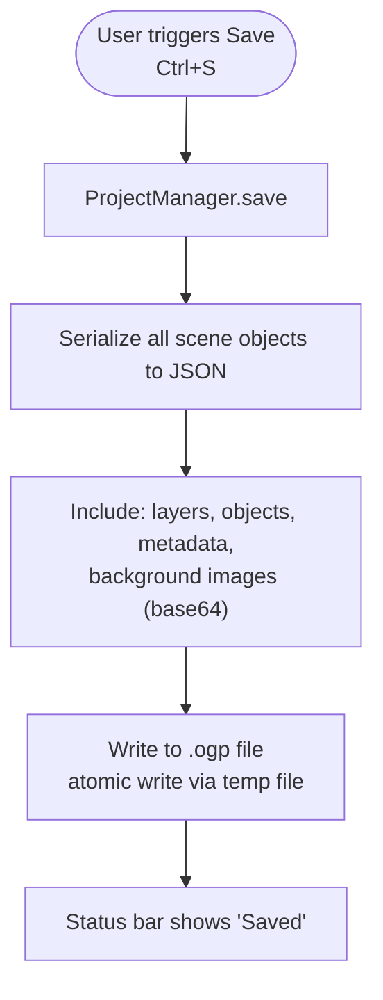
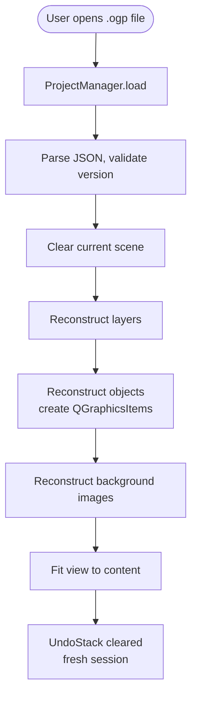
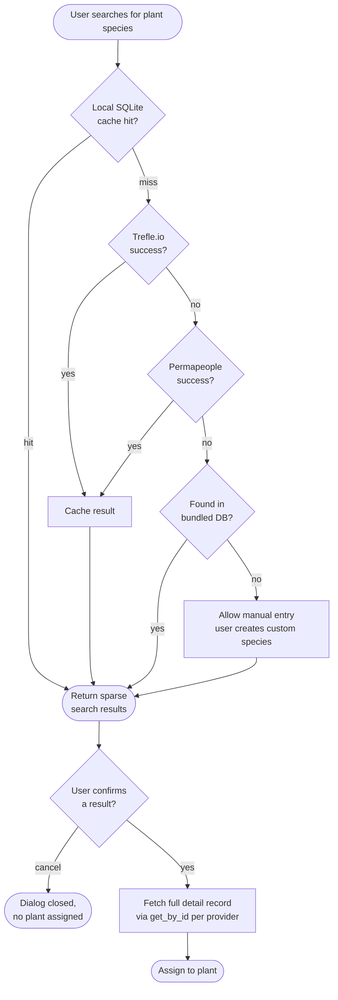
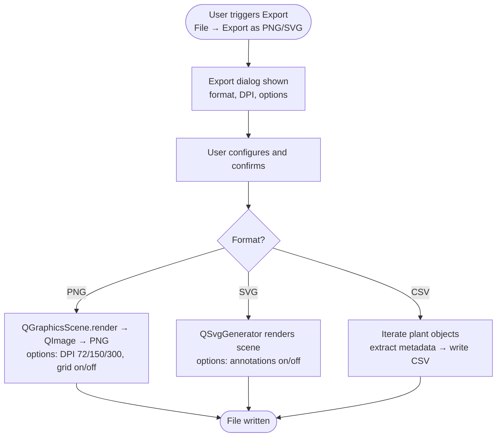
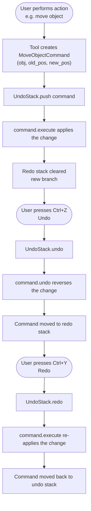
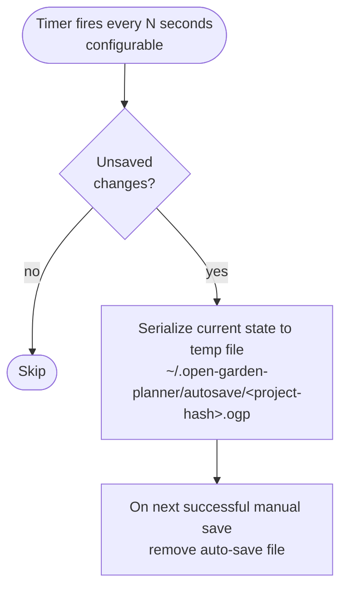
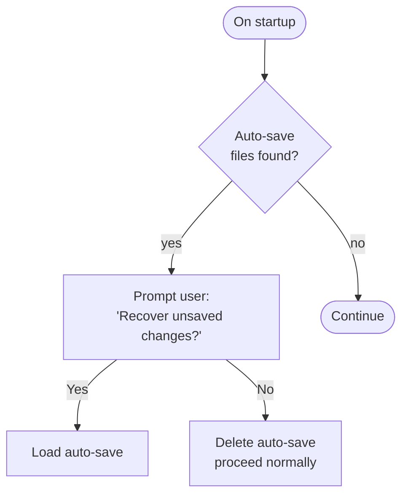

# 6. Runtime View

## 6.1 Drawing Workflow

## 6.2 Save/Load Flow

### Save

### Load

## 6.3 Plant API Integration Flow

**Search vs. detail data (issue #297):** `search()` results (the `Return` node
above) are sparse for most providers -- Trefle's in particular omits
`growth`/`specifications`/`foliage` entirely, leaving sun/water/pH/nutrient/
foliage at UNKNOWN/None. `PlantSearchDialog` fetches the richer per-species
record via `PlantAPIManager.get_by_id()` only once the user **confirms** a
result (the `Confirm`/`Detail` nodes) -- not per browsed row, to avoid one
extra request per visible search result against rate-limited free tiers. A
failed detail fetch falls back to the sparse result with a user-facing
warning rather than blocking the assignment; a successful fetch is **merged**
onto the search result (enrichment fields from the detail response, identity
fields kept from the search result unless the detail response improves on
them) rather than swapped in wholesale. The `Confirm -->|yes| Detail` edge is
simplified: a result from the `Manual`/custom-library path (`data_source ==
"custom"`) skips the fetch entirely, since a locally-stored entry has no
online detail endpoint and is already complete. This diagram's `Cache`/`Bundled
DB` branches predate this fix and remain aspirational -- see `manager.py`'s
`# TODO: Add bundled database client` and the #296 entry in
`docs/11-risks-and-technical-debt/README.md` §11.4.

## 6.4 Export Flow

## 6.5 Undo/Redo Flow

## 6.6 Auto-Save Flow

