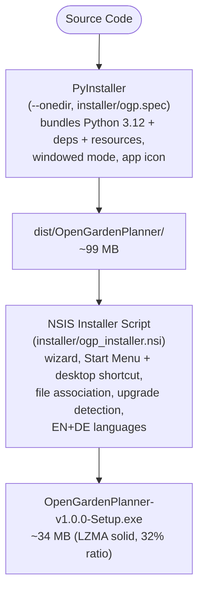
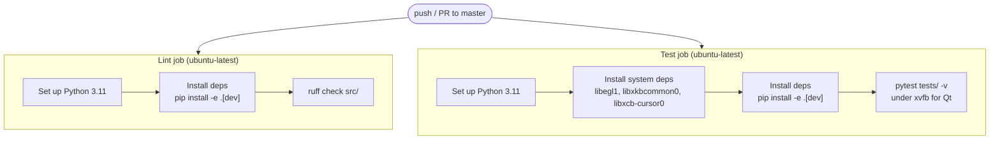
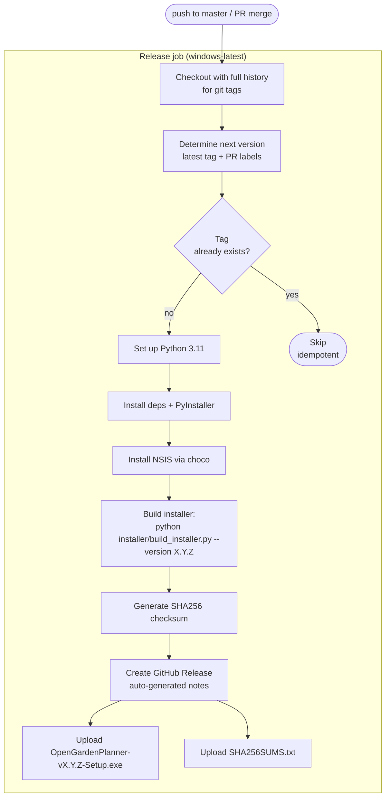

# 7. Deployment View

## 7.1 Distribution Strategy

Open Garden Planner is distributed as:

1. **Windows Installer (primary)**: NSIS-based installer wrapping a PyInstaller bundle
2. **pip install (secondary)**: For Python users who prefer package manager installation
3. **Source (developer)**: Clone repository and run with `python -m open_garden_planner`

## 7.2 Windows Installer (NSIS)

### Build Pipeline



See the **Installer Features** table below for the full feature list.

### How to Build

The build is orchestrated by `installer/build_installer.py`:

```bash
# Prerequisites
pip install pyinstaller                    # Python bundler
# Install NSIS from https://nsis.sourceforge.io/

# Full build (PyInstaller + NSIS)
python installer/build_installer.py

# PyInstaller only (skip NSIS)
python installer/build_installer.py --skip-nsis

# NSIS only (requires existing PyInstaller output in dist/)
python installer/build_installer.py --skip-pyinstaller
```

### Installer Files

| File | Purpose |
|------|---------|
| `installer/ogp.spec` | PyInstaller spec file (entry point, resources, excludes, icon) |
| `installer/ogp_installer.nsi` | NSIS installer script (wizard, registry, file association) |
| `installer/build_installer.py` | Build orchestration script |
| `installer/ogp_app.ico` | Application icon (multi-size: 16–256px) |
| `installer/ogp_file.ico` | `.ogp` file type icon |
| `LICENSE` | GPLv3 license text (displayed during install) |

### Installer Features

| Feature | Description |
|---------|-------------|
| **Welcome Page** | Branded welcome with app description |
| **License Display** | GPLv3 license agreement |
| **Install Path** | User-selectable (default: `C:\Program Files\Open Garden Planner`) |
| **Components** | Core (required), desktop shortcut (optional), file association (optional) |
| **Start Menu** | Shortcut in Start Menu Programs folder + uninstaller shortcut |
| **Desktop Shortcut** | Optional desktop shortcut (component checkbox) |
| **File Association** | `.ogp` files open with Open Garden Planner |
| **Custom File Icon** | OGP logo icon for `.ogp` files in Explorer |
| **Upgrade Support** | Detects existing installation, offers silent uninstall before upgrade |
| **Uninstaller** | Clean removal via Add/Remove Programs |
| **Installer Size** | ~34 MB (LZMA compressed, well under 100 MB target) |
| **Languages** | English, German |

### File Association

Registry entries created by the installer:

```
HKCR\.ogp                                          → "OpenGardenPlanner.Project"
HKCR\.ogp\Content Type                              → "application/x-ogp"
HKCR\OpenGardenPlanner.Project                      → "Open Garden Planner Project"
HKCR\OpenGardenPlanner.Project\DefaultIcon          → "$INSTDIR\ogp_file.ico,0"
HKCR\OpenGardenPlanner.Project\shell\open\command   → "$INSTDIR\OpenGardenPlanner.exe" "%1"
```

The application accepts a `.ogp` file path as a command-line argument (`main.py` handles `sys.argv`), enabling double-click-to-open.

### Add/Remove Programs

Registry entries under `HKLM\Software\Microsoft\Windows\CurrentVersion\Uninstall\Open Garden Planner`:

| Key | Value |
|-----|-------|
| `DisplayName` | Open Garden Planner |
| `DisplayVersion` | 1.0.0 |
| `Publisher` | cofade |
| `URLInfoAbout` | https://github.com/cofade/open-garden-planner |
| `DisplayIcon` | `$INSTDIR\ogp_app.ico` |
| `UninstallString` | `$INSTDIR\Uninstall.exe` |
| `EstimatedSize` | (computed at install time) |

## 7.3 Release Process (GitHub Releases)

### Creating a Release (Automated)

Releases are fully automated via the `release.yml` GitHub Actions workflow:

1. **Create a PR** to `master` with your changes
2. **Add a version label** to the PR: `major`, `minor`, or `patch` (default if no label)
3. **Merge the PR** — the release workflow automatically:
   - Computes the next version from the latest git tag + PR label
   - Builds the Windows installer (PyInstaller + NSIS) on a Windows runner
   - Generates SHA256 checksums
   - Creates a GitHub Release with auto-generated notes
   - Uploads the installer `.exe` and `SHA256SUMS.txt` as release assets
   - Tags the release as `vX.Y.Z`

### Creating a Release (Manual Fallback)

If CI/CD is unavailable, releases can be built locally:

1. **Tag the release**: `git tag -a v1.0.0 -m "Release v1.0.0"`
2. **Build the installer**: `python installer/build_installer.py --version 1.0.0`
3. **Generate checksums**:
   ```powershell
   (Get-FileHash dist\OpenGardenPlanner-v1.0.0-Setup.exe -Algorithm SHA256).Hash > dist\SHA256SUMS.txt
   ```
4. **Create GitHub Release**: Upload `OpenGardenPlanner-v1.0.0-Setup.exe` and `SHA256SUMS.txt` as release assets
5. **Release notes**: Include changelog, system requirements, and verification instructions

### Release Assets

Each release should include:

| Asset | Purpose |
|-------|---------|
| `OpenGardenPlanner-v{VERSION}-Setup.exe` | Windows installer |
| `SHA256SUMS.txt` | SHA-256 checksum for download verification |

### Verification

Users verify download integrity by comparing checksums:

```powershell
# PowerShell
(Get-FileHash .\OpenGardenPlanner-v1.0.0-Setup.exe -Algorithm SHA256).Hash
# Compare with SHA256SUMS.txt from release page
```

## 7.4 CI/CD Pipeline (GitHub Actions)

Two workflow files in `.github/workflows/`:

### CI Workflow (`ci.yml`)

**Trigger**: Every push to any branch + every PR to `master`



### Release Workflow (`release.yml`)

**Trigger**: Push to `master` (i.e., PR merge)

**Version bumping**: Automatic based on PR labels:
- Label `major` → bump major (1.0.0 → 2.0.0)
- Label `minor` → bump minor (1.0.0 → 1.1.0)
- Label `patch` or no label → bump patch (1.0.0 → 1.0.1)



### PR Labels for Versioning

| Label | Effect | Example |
|-------|--------|---------|
| `major` | Breaking changes, major new version | 1.0.1 → 2.0.0 |
| `minor` | New features, backward compatible | 1.0.1 → 1.1.0 |
| `patch` | Bug fixes, small improvements (default) | 1.0.1 → 1.0.2 |

## 7.5 System Requirements

| Requirement | Minimum |
|-------------|---------|
| **OS** | Windows 10 (64-bit) |
| **RAM** | 4 GB |
| **Disk** | 200 MB free space |
| **Display** | 1280x720 |
| **GPU** | Any (Qt uses software rendering fallback) |
| **Internet** | Optional (for plant database search) |
