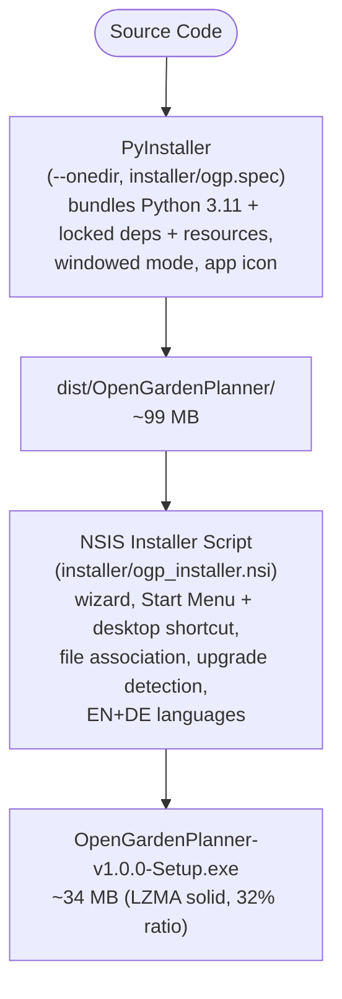
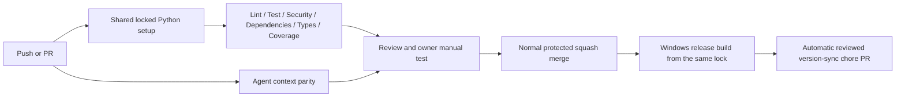
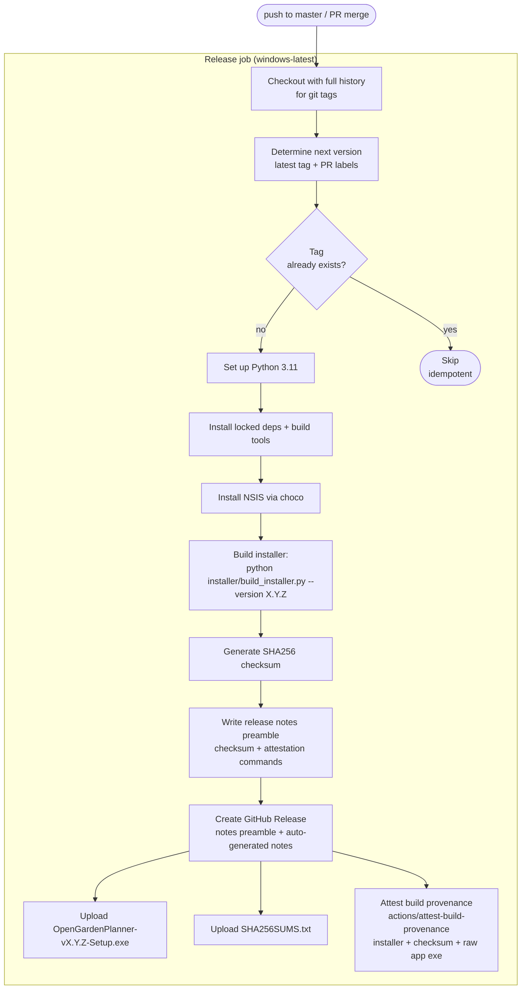

# 7. Deployment View

## 7.1 Distribution Strategy

Open Garden Planner is distributed as:

1. **Windows Installer (primary)**: NSIS-based installer wrapping a PyInstaller bundle
2. **pip install (secondary)**: For Python users who prefer package manager installation
3. **Source (developer)**: Clone repository and run with `python -m open_garden_planner`

## 7.2 Windows Installer (NSIS)

### Build Pipeline


```mermaid
flowchart TD
    Src([Source Code])
    PI["PyInstaller<br/>(--onedir, installer/ogp.spec)<br/>bundles Python 3.11 + locked deps + resources,<br/>windowed mode, app icon"]
    Bundle["dist/OpenGardenPlanner/<br/>~99 MB"]
    NSIS["NSIS Installer Script<br/>(installer/ogp_installer.nsi)<br/>wizard, Start Menu + desktop shortcut,<br/>file association, upgrade detection,<br/>EN+DE languages"]
    Out["OpenGardenPlanner-v1.0.0-Setup.exe<br/>~34 MB (LZMA solid, 32% ratio)"]

    Src --> PI --> Bundle --> NSIS --> Out
```

See the **Installer Features** table below for the full feature list.

### How to Build

The build is orchestrated by `installer/build_installer.py`:

```bash
# Prerequisites
# Install the locked environment including its build group (README development setup)
# Install NSIS from https://nsis.sourceforge.io/

# Full build (PyInstaller + NSIS)
python installer/build_installer.py

# PyInstaller only (skip NSIS)
python installer/build_installer.py --skip-nsis

# NSIS only (requires existing PyInstaller output in dist/)
python installer/build_installer.py --skip-pyinstaller
```

### Installer Files

| File | Purpose |
|------|---------|
| `installer/ogp.spec` | PyInstaller spec file (entry point, resources, excludes, icon) |
| `installer/ogp_installer.nsi` | NSIS installer script (wizard, registry, file association) |
| `installer/build_installer.py` | Build orchestration script |
| `installer/ogp_app.ico` | Application icon (multi-size: 16–256px) |
| `installer/ogp_file.ico` | `.ogp` file type icon |
| `LICENSE` | GPLv3 license text (displayed during install) |

### Installer Features

| Feature | Description |
|---------|-------------|
| **Welcome Page** | Branded welcome with app description |
| **License Display** | GPLv3 license agreement |
| **Install Path** | User-selectable (default: `C:\Program Files (x86)\Open Garden Planner` — NSIS `$PROGRAMFILES` on 64-bit Windows, see §11.4 issue #199) |
| **Components** | Core (required), desktop shortcut (optional), file association (optional) |
| **Start Menu** | Shortcut in Start Menu Programs folder + uninstaller shortcut |
| **Desktop Shortcut** | Optional desktop shortcut (component checkbox) |
| **File Association** | `.ogp` files open with Open Garden Planner |
| **Custom File Icon** | OGP logo icon for `.ogp` files in Explorer |
| **Upgrade Support** | Detects existing installation, offers silent uninstall before upgrade |
| **Uninstaller** | Clean removal via Add/Remove Programs |
| **User-Data Preservation** | Before wiping `$INSTDIR`, the uninstaller copies any `*.ogp` plans found there to `Documents\Open Garden Planner\Recovered Plans` (issue #199) |
| **Installer Size** | ~34 MB (LZMA compressed, well under 100 MB target) |
| **Languages** | English, German |

> **Why user-data preservation matters (issue #199):** The uninstall section runs
> `RMDir /r "$INSTDIR"`, and the upgrade path silently invokes the *old* uninstaller
> before installing the new build — so an in-place update wipes the entire install
> directory. Users who had saved `.ogp` plans inside the install folder lost them. Two
> guards now exist: (1) the app defaults all save/open/export dialogs to
> `Documents\Open Garden Planner` (`app/paths.get_projects_dir()`) so new data never
> lands under `$INSTDIR`; (2) the uninstaller backs up any pre-existing `$INSTDIR\*.ogp`
> to `Documents\Open Garden Planner\Recovered Plans` before the recursive delete.

### File Association

Registry entries created by the installer:

```
HKCR\.ogp                                          → "OpenGardenPlanner.Project"
HKCR\.ogp\Content Type                              → "application/x-ogp"
HKCR\OpenGardenPlanner.Project                      → "Open Garden Planner Project"
HKCR\OpenGardenPlanner.Project\DefaultIcon          → "$INSTDIR\ogp_file.ico,0"
HKCR\OpenGardenPlanner.Project\shell\open\command   → "$INSTDIR\OpenGardenPlanner.exe" "%1"
```

The application accepts a `.ogp` file path as a command-line argument (`main.py` handles `sys.argv`), enabling double-click-to-open.

### Add/Remove Programs

Registry entries under `HKLM\Software\Microsoft\Windows\CurrentVersion\Uninstall\Open Garden Planner`:

| Key | Value |
|-----|-------|
| `DisplayName` | Open Garden Planner |
| `DisplayVersion` | 1.0.0 |
| `Publisher` | cofade |
| `URLInfoAbout` | https://github.com/cofade/open-garden-planner |
| `DisplayIcon` | `$INSTDIR\ogp_app.ico` |
| `UninstallString` | `$INSTDIR\Uninstall.exe` |
| `EstimatedSize` | (computed at install time) |

## 7.3 Release Process (GitHub Releases)

### Creating a Release (Automated)

Releases are fully automated via the `release.yml` GitHub Actions workflow:

1. **Create a PR** to `master` with your changes
2. **Add a version label** to the PR: `major`, `minor`, or `patch` (default if no label)
3. **Merge the PR** — the release workflow automatically:
   - Computes the next version from the latest git tag + PR label
   - Builds the Windows installer (PyInstaller + NSIS) on a Windows runner
   - Generates SHA256 checksums
   - Creates a GitHub Release with auto-generated notes (a verification
     preamble with the checksum + attestation commands is prepended)
   - Uploads the installer `.exe` and `SHA256SUMS.txt` as release assets
   - Tags the release as `vX.Y.Z`
   - Attests build provenance (`actions/attest-build-provenance`,
     Sigstore-backed; see §7.3 Verification and ADR-044) for the installer,
     `SHA256SUMS.txt`, and the raw app exe it packages — run *after* the
     release is published so a Sigstore hiccup never costs a release

### Creating a Release (Manual Fallback)

If CI/CD is unavailable, releases can be built locally:

1. **Build a local verification artifact** for the intended version; never create tags manually. CI remains the sole release/tag authority.
2. **Build the installer**: `python installer/build_installer.py --version 1.0.0`
3. **Generate checksums**:
   ```powershell
   (Get-FileHash dist\OpenGardenPlanner-v1.0.0-Setup.exe -Algorithm SHA256).Hash > dist\SHA256SUMS.txt
   ```
4. **Do not publish manually**: restore CI and use its normal release workflow for tagged artifacts.
5. **Release notes**: Include changelog, system requirements, and verification instructions

Note: build provenance attestation (§7.3 Verification) requires GitHub's OIDC
token and can only be produced by an `actions/attest-build-provenance` step
running inside GitHub Actions — a manually-built release has no attestation
to verify, checksums only.

### Release Assets

Each release should include:

| Asset | Purpose |
|-------|---------|
| `OpenGardenPlanner-v{VERSION}-Setup.exe` | Windows installer |
| `SHA256SUMS.txt` | SHA-256 checksum for download verification |
| Build provenance attestation | Not an uploaded asset — stored by GitHub against the installer, `SHA256SUMS.txt`, and the raw app exe; verify with `gh attestation verify` (§7.3 Verification, ADR-044) |

### Verification

Users verify download integrity by comparing checksums:

```powershell
# PowerShell
(Get-FileHash .\OpenGardenPlanner-v1.0.0-Setup.exe -Algorithm SHA256).Hash
# Compare with SHA256SUMS.txt from release page
```

From the next release onward, users can additionally verify build
provenance — a cryptographic proof, independent of the checksum, that a
release artifact was produced by this repo's public `release.yml` run from a
specific public commit (not built or modified anywhere else). This covers
the installer, `SHA256SUMS.txt`, and the raw app exe the installer packages
(`OpenGardenPlanner.exe`, the file named in issue #356's Defender report),
each attested independently:

```bash
gh attestation verify OpenGardenPlanner-v1.0.0-Setup.exe -R cofade/open-garden-planner --signer-workflow cofade/open-garden-planner/.github/workflows/release.yml
```

`--signer-workflow` pins verification to this repo's own release workflow
specifically, not merely "any workflow with `attestations: write` in this
repository."

This does not make the installer Authenticode-signed and does not by itself
suppress SmartScreen/Defender (issue #356) or Norton FileRep (issue #358)
warnings — see §11.1/§11.2 and ADR-044.

## 7.4 CI/CD Pipeline (GitHub Actions)

Two workflow files in `.github/workflows/`:

### CI Workflow (`ci.yml`)

**Trigger**: every branch push and every PR to `master`. Python dependencies come from
`uv.lock` through the shared setup-locked-env action. The PEP 751 export is checked for drift.
Qt workflows use `QT_QPA_PLATFORM=offscreen`; xvfb is not part of this CI recipe.

| Job key | Check name | Platform | Behavior |
|---|---|---|---|
| `agent-context` | Agent context parity | Linux | Root instructions and mirrored agent context |
| `lint` | Lint | Linux | Ruff over source, tests and scripts |
| `test` | Test | Linux | Full pytest suite, Qt offscreen |
| `security` | Security | Linux | Bandit HIGH findings and tracked-secret scan |
| `dependencies` | Dependencies (ubuntu-latest/windows-latest) | Matrix | Clean locked installation, freshness and export checks |
| `types` | Types (ubuntu-latest/windows-latest) | Matrix | Strict mypy against per-file platform allowances |
| `coverage` | Coverage | Linux | Full-suite line/branch report and per-package line floors |

The matrix jobs each emit two concrete check names. The reviewed protection payload requires
the existing checks plus both dependency/type matrix results and an up-to-date PR. Coverage
is initially not required by GitHub protection; failed CI still requires investigation before
finalization. Protection activation is pending owner-approved finalization of #399.


```mermaid
flowchart LR
    Push[Push or PR] --> Setup[Shared locked Python setup]
    Setup --> Gates[Lint / Test / Security / Dependencies / Types / Coverage]
    Push --> Context[Agent context parity]
    Gates --> Review[Review and owner manual test]
    Context --> Review
    Review --> Merge[Normal protected squash merge]
    Merge --> Release[Windows release build from the same lock]
    Release --> Sync[Automatic reviewed version-sync chore PR]
```

Local frozen-exe build, startup smoke and subsystem self-test remain mandatory before merge.
The release job repeats its subsystem self-test after the installer build. See ADR-050.

### Release Workflow (`release.yml`)

**Trigger**: Push to `master` (i.e., PR merge)

**Version bumping**: Automatic based on PR labels:
- Label `major` → bump major (1.0.0 → 2.0.0)
- Label `minor` → bump minor (1.0.0 → 1.1.0)
- Label `patch` or no label → bump patch (1.0.0 → 1.0.1)


```mermaid
flowchart TD
    Trigger(["push to master / PR merge"])
    subgraph Job["Release job (windows-latest)"]
        R1[Checkout with full history<br/>for git tags]
        R2[Determine next version<br/>latest tag + PR labels]
        R3{Tag<br/>already exists?}
        R4[Set up Python 3.11]
        R5[Install locked deps + build tools]
        R6[Install NSIS via choco]
        R7["Build installer:<br/>python installer/build_installer.py --version X.Y.Z"]
        R8[Generate SHA256 checksum]
        R8b[Write release notes preamble<br/>checksum + attestation commands]
        R9[Create GitHub Release<br/>notes preamble + auto-generated notes]
        R10a[Upload OpenGardenPlanner-vX.Y.Z-Setup.exe]
        R10b[Upload SHA256SUMS.txt]
        R11["Attest build provenance<br/>actions/attest-build-provenance<br/>installer + checksum + raw app exe"]
        Skip([Skip<br/>idempotent])

        R1 --> R2 --> R3
        R3 -->|yes| Skip
        R3 -->|no| R4 --> R5 --> R6 --> R7 --> R8 --> R8b --> R9
        R9 --> R10a
        R9 --> R10b
        R9 --> R11
    end

    Trigger --> R1
```

### PR Labels for Versioning

| Label | Effect | Example |
|-------|--------|---------|
| `major` | Breaking changes, major new version | 1.0.1 → 2.0.0 |
| `minor` | New features, backward compatible | 1.0.1 → 1.1.0 |
| `patch` | Bug fixes, small improvements (default) | 1.0.1 → 1.0.2 |

## 7.5 System Requirements

| Requirement | Minimum |
|-------------|---------|
| **OS** | Windows 10 (64-bit) |
| **RAM** | 4 GB |
| **Disk** | 200 MB free space |
| **Display** | 1280x720 |
| **GPU** | Any (Qt uses software rendering fallback) |
| **Internet** | Optional (for plant database search) |

## 7.6 Agent API / MCP Bundling (US-D1.1)

The embedded MCP server (`agent_api/`, see §8.19, ADR-033) adds the `mcp` /
`uvicorn` / `starlette` / `pydantic` stack (+ transitive `anyio`,
`sse-starlette`, `pydantic-core`, `pydantic-settings`, `httpx`, `cryptography`).
Freezing this stack into the PyInstaller exe required three fixes in
`installer/ogp.spec`, each found by actually running the **frozen** server (the
US-D1.1 bundling proof) — dev tests don't surface them:

- **Collect dynamic submodules + metadata.** uvicorn/anyio/starlette load
  protocol, loop and lifespan submodules dynamically, and several packages read
  their distribution metadata at import; so the spec does
  `collect_submodules(...)` + `copy_metadata(...)` for the stack.
- **Do NOT walk top-level `mcp`.** `collect_submodules("mcp")` imports
  `mcp.cli`, which calls `sys.exit(1)` when the optional `cli` (`typer`) extra is
  absent, aborting the build. The spec collects the concrete subpackages
  (`mcp.server`, `mcp.shared`, `mcp.types`) instead, wrapped in a
  `_safe_collect_submodules` guard.
- **Do NOT exclude `multiprocessing`.** uvicorn imports it eagerly
  (`uvicorn.supervisors → basereload → _subprocess`) even when run
  single-process; excluding it makes the frozen server raise
  `ModuleNotFoundError: multiprocessing` at start (the GUI still runs, the server
  silently fails). It was removed from the spec `excludes`.
- **UPX.** `pydantic_core*.pyd` is `upx_exclude`d (UPX can corrupt the compiled
  extension).

**Verify after any change to the stack:** build the exe, enable the Agent API
(Preferences), and confirm an MCP client can reach `http://127.0.0.1:8765/mcp`
from the *frozen* app — not just from `pytest`.

### Locked development and release environments

`pyproject.toml` declares dependency constraints, the build group and the exact uv tool pin.
`uv.lock` selects universal/platform package versions; `pylock.toml` is its generated PEP 751
export. The lock preserves v1.29.5 selections recorded in `quality/dependency-provenance.json`;
setuptools and wheel are explicit build-backend additions. uv is MIT/Apache-2.0 dual licensed
and is a development tool, not an application dependency. PyInstaller retains its bundling
exception; hooks-contrib remains build tooling. Python dependencies are locked; runner images,
Python patch versions and NSIS are outside this reproducibility claim.

Use the project-pinned uv bootstrap shown in the README. Install with
`uv sync --locked --python 3.11 --all-extras --group build --no-install-project`, then
`uv pip install --python .venv/Scripts/python.exe --no-deps --no-build-isolation --editable .`
on Windows (`.venv/bin/python` on Linux). The build backend is already in the locked environment.
Run `uv pip check` and `python scripts/check_dependency_lock.py` using that environment.

Dependency refreshes are separately reviewed `chore(deps):` PRs with licence and frozen-build
checks. Regenerate the export with the command in ADR-050; never hand-edit its package records.

### Protected finalization

After owner manual-test approval, `finalize-us` verifies the current head and all required
checks, marks the feature ready and merges normally. It waits for the successful Release run
and tag belonging to that merge SHA, then prepares `chore/sync-vX.Y.Z-pr-N`. The helper
`scripts/prepare_version_sync.py` updates both source versions and refreshes the lock offline
without changing third-party selections. A reviewed draft chore PR is checked and merged under
the same authorization, followed by wiki sync and cleanup; no second confirmation is needed.
The chore squash prefix skips Release. A chore-only finalization never waits for a new tag.

Activation is reviewed separately from code delivery: apply `quality/master-protection.json`
during the approved #399 finalization and verify with `scripts/check_branch_protection.py`.
It removes the current review requirement, enforces checks for administrators and retains
blocked force pushes/deletion. Test refusal and acceptance on a temporary protected validation
base; never attempt a deliberately broken merge into master.
